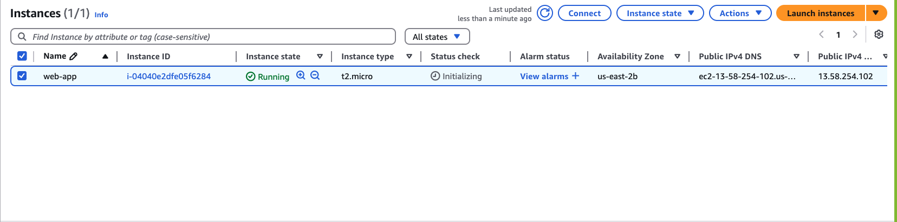
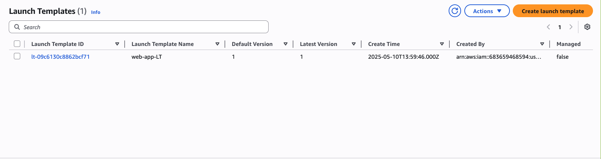
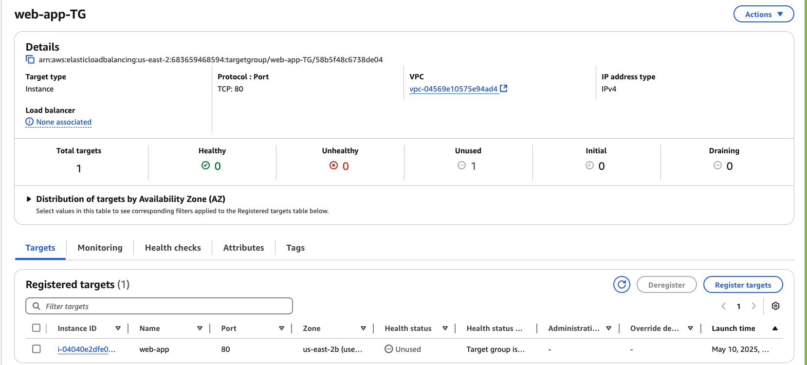
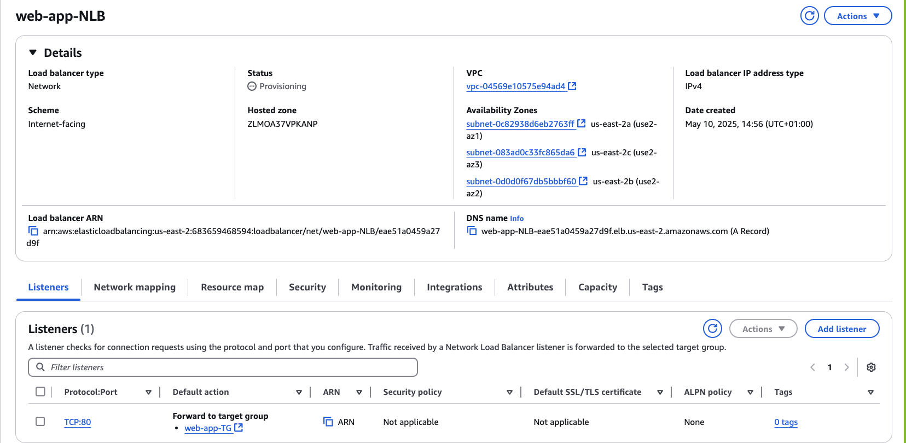
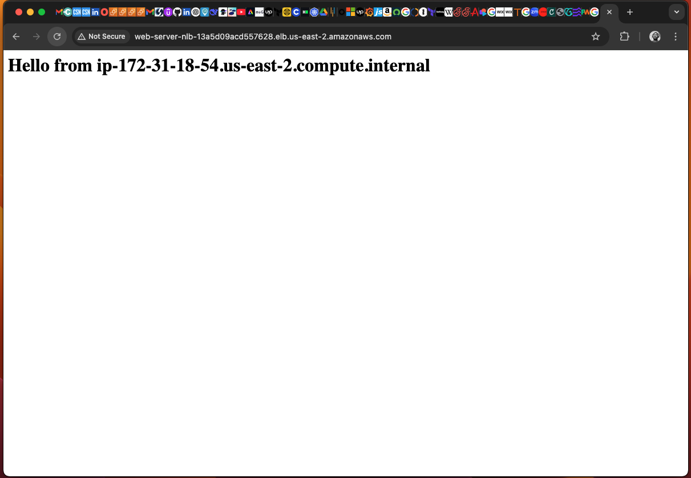
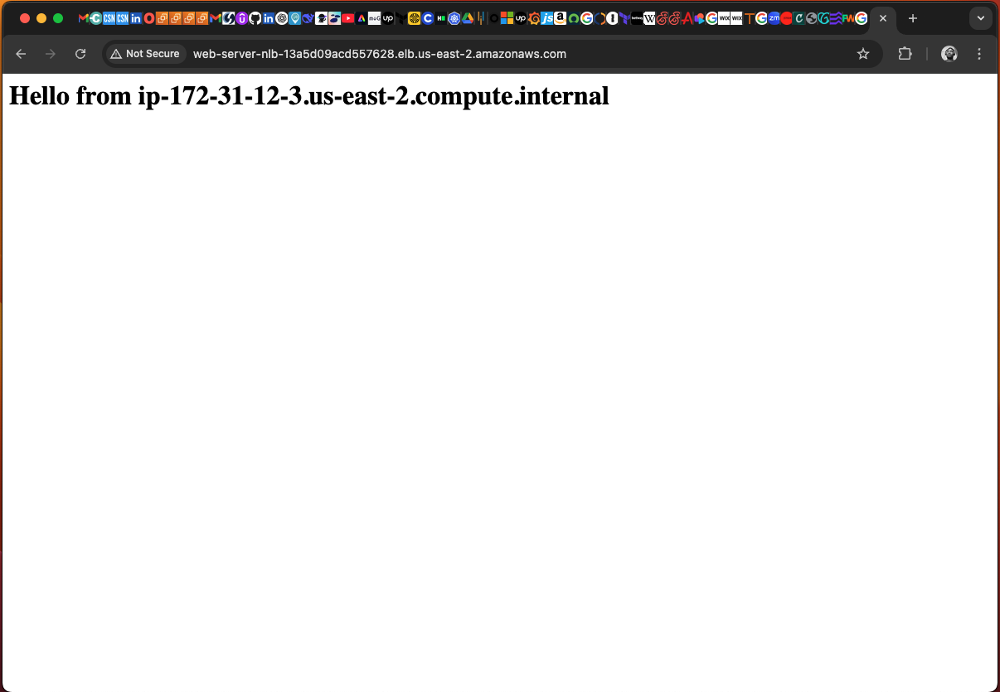
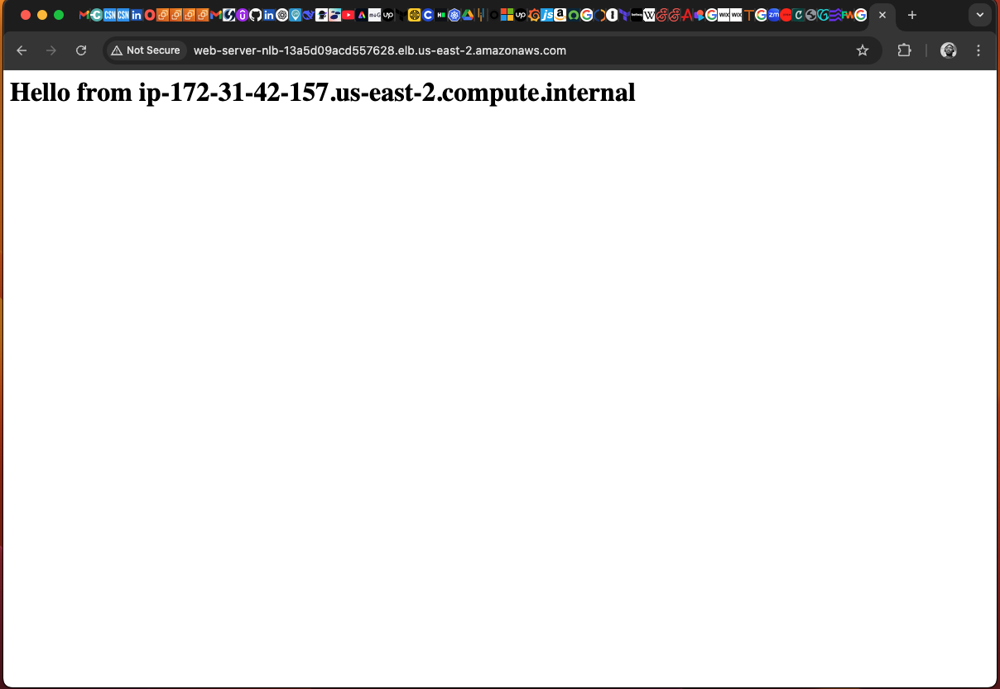

# Scalable Web App with Amazon EC2, Network Load Balancer & Auto Scaling Group

This project demonstrates how to deploy a scalable web application on AWS using EC2, a Network Load Balancer (NLB), and an Auto Scaling Group (ASG). It ensures high availability and scalability by distributing traffic across multiple EC2 instances and scaling automatically based on load.

---

## 🚀 Installation Steps

### Step 1: Launch EC2 Instance

- Go to **EC2 → Instances → Launch new instance**
- **Name:** `web-app`  
- **Amazon AMI:** Ubuntu  
- **Instance Type:** `t2.micro`  
- **Key Pair:** Create or select an existing one  
- **Security Group:**  
  - Allow port `22` (SSH)  
  - Allow port `80` (HTTP)  
- **User Data:**
  ```bash
  #!/bin/bash
  sudo apt-get update
  sudo apt-get install -y apache2
  sudo systemctl start apache2
  sudo systemctl enable apache2
  echo "<h1>Hello from $(hostname -f)</h1>" > /var/www/html/index.html
  ```

📸 *EC2 Instance Launch Configuration*
 


---

### Step 2: Create Launch Template

- Select the instance created above  
- Go to **Actions → Image and templates → Create template from instance**  
- **Name:** `web-app-LT`  
- Leave other settings as default and create the launch template

📸 *Launch Template Creation* 



---

### Step 3: Create Target Group

- Go to **EC2 → Target Groups → Create Target Group**  
- **Target type:** Instance  
- **Name:** `web-app-TG`  
- Register the existing instance and create the target group

📸 *Target Group Configuration*



---

### Step 4: Create Network Load Balancer (NLB)

- Go to **EC2 → Load Balancers → Create Load Balancer**  
- Choose **Network Load Balancer**  
- **Name:** `web-app-NLB`  
- **Scheme:** Internet-facing  
- **Listeners:** HTTP on port `80`  
- **Target Group:** Use `web-app-TG`  
- **VPC & Subnets:** Select the same VPC and choose at least 2 subnets  
- Create the Load Balancer

📸 *Network Load Balancer Setup*



---

### Step 5: Create Auto Scaling Group

- Go to **EC2 → Auto Scaling Groups → Create Auto Scaling Group**  
- **Name:** `web-app-ASG`  
- **Launch Template:** Select `web-app-LT`  
- **Group Size:**  
  - Desired Capacity: `2`  
  - Min: `1`, Max: `4`  
- **Network:** Use existing VPC and at least 2 subnets  
- **Attach Load Balancer:** Choose NLB and select `web-app-TG`  
- **Scaling Policy (Optional):**  
  - Scale out when CPU > 60%  
  - Scale in when CPU < 40%  
- Create the Auto Scaling Group

📸 *Auto Scaling Group Configuration*


---

## 🌐 Access the Web App

Open your browser and enter the NLB DNS name:

```
http://<your-nlb-dns-name>
```

You should see:

```
Hello from <instance-hostname>
```

Refresh the page to see responses from different instances.

---

## ✅ Verify Auto Scaling

- Manually stop or terminate an instance  
- A new instance should be launched automatically by the Auto Scaling Group

📸 *Auto Scaling in Action*  






---

## 🧰 Technologies Used

- **Amazon EC2**
- **Amazon Network Load Balancer**
- **Amazon Auto Scaling Group**

---

## 👥 Collaborators

- Eric Gomado  
- Augustine Tetteh Ozor
